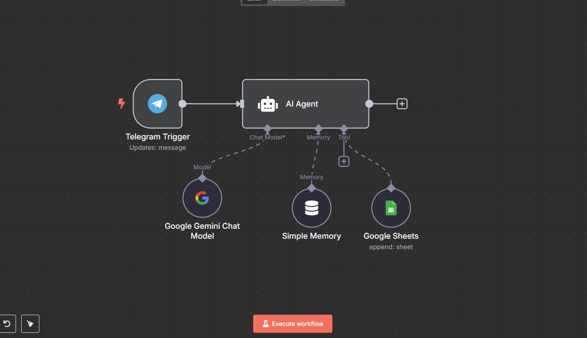

# expense-ai-agent 🤖💸

An AI-powered automation built using [n8n](https://n8n.io/) that captures expense details from a **Telegram bot** and logs them into an **Excel sheet** — smartly extracting insights using the **Gemini API**.

 

## 🚀 What It Does

Whenever a user sends an expense message via Telegram (e.g., `₹200 lunch at Subway` or `Cab - ₹450`), this AI agent:

1. Uses **Gemini API** to extract and interpret:
   - **Amount**
   - **Item**
   - **Category** (e.g., Food, Travel, Entertainment)
   - **Description**
   - **Date** (or assigns the current timestamp if missing)

2. Writes the parsed data into an Excel file with the following structure:  
   `Date | Item | Amount | Category | Description`

✅ Supports messages with currency symbols  
✅ Intelligently categorizes expenses using Gemini  
✅ Uses current timestamp when date is missing  

---

## 🛠️ Setup Instructions

1. Clone this repository:
   ```bash
   git clone https://github.com/yourusername/expense-ai-agent.git
2. Open [n8n](https://n8n.io/) and import the provided .json workflow.
3. Configure the node with the required credentials.
4. Deploy the workflow and test it by sending an expense message to your Telegram bot. Your Excel sheet should update instantly!

## 🙌 Contribute
Feel free to fork this project, improve the logic, or add new features like multi-user support, analytics dashboard, or budget alerts. PRs are welcome!

